# SimTale

*Leia em [Inglês](README.md)*


SimTale é um mod de simulação social para Hytale que implementa NPCs autônomos com rastreamento de estado individual para necessidades, personalidades, rotinas e relacionamentos.

O comportamento dos NPCs é guiado por seus estados internos e consultas ao ambiente, em vez de scripts fixos ou árvores de diálogo.

O mod inclui **800 variantes visuais distintas** de NPCs:
- 400 Adultos (200 Homens, 200 Mulheres)
- 400 Crianças (200 Meninos, 200 Meninas)

Durante a instanciação, cada NPC recebe propriedades aleatórias de personalidade, traços, hobbies e preferências de itens.

<p align="center">
  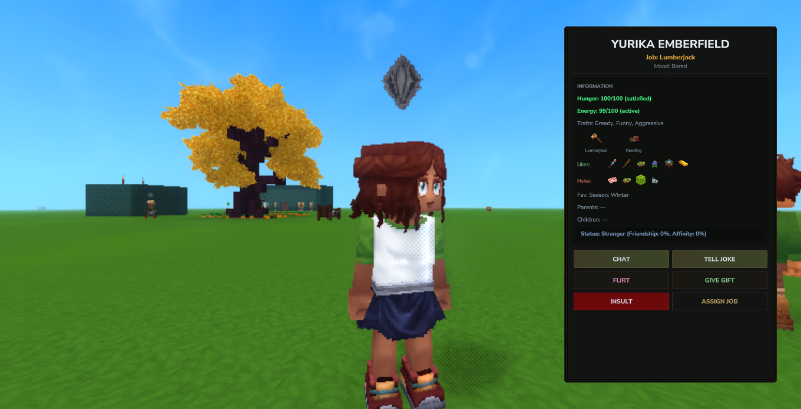
  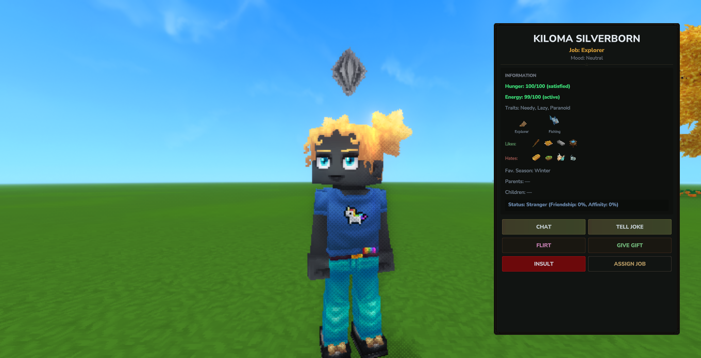
  <br />
  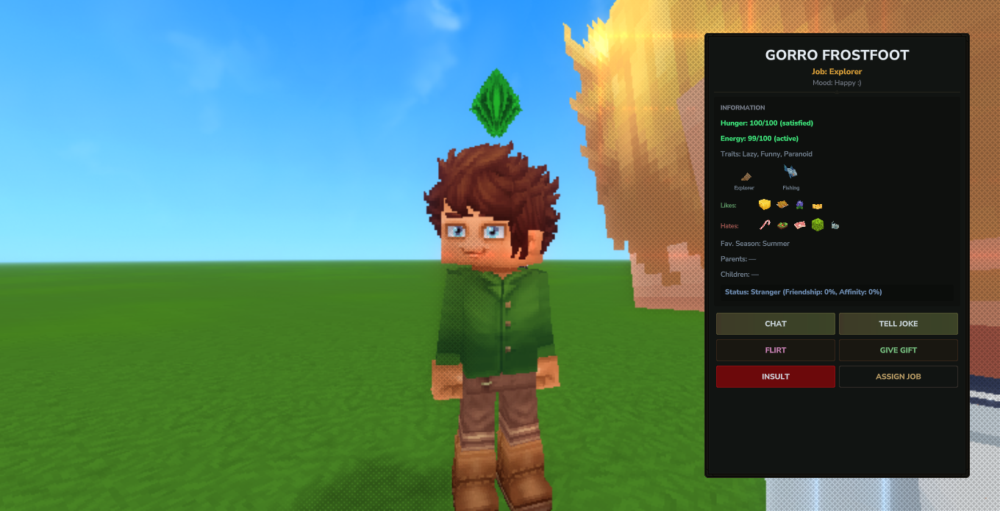
  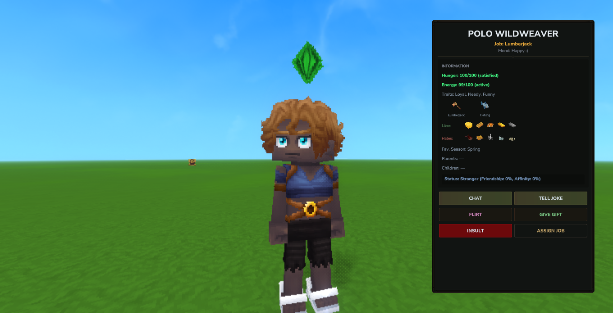
</p>

## O que um NPC faz sozinho

- **Dorme à noite.** Quando a noite cai, ele larga o que estiver fazendo e vai para a própria cama. NPCs com o traço "Preguiçoso" vão dormir mais cedo (quando a energia cai abaixo de 60). Guardas fazem o turno oposto: acordados à noite, dormem de dia.
- **Come quando tem fome.** Procura por comida nos baús da casa onde mora (dentro de um raio de 24 blocos), e escolhe a melhor: comida cozida tem prioridade sobre carne crua, e ele evita o que odeia.
- **Vive em uma casa.** Reivindica uma cama e trata aquele lugar como seu. 
- **Pertence a uma vila.** Casas construídas perto umas das outras formam uma vila, calculada a partir das próprias construções. NPCs sem casa ficam perto do centro da vila em vez de vagar sem rumo.
- **Trabalha.** Fazendeiros colhem plantações (Cenoura, Trigo, Tomate, Milho), replantam sementes e guardam a colheita. Caçadores e Mineradores saem em expedições e voltam com espólios.
- **Conversa.** Procura outros NPCs em um raio de 20 blocos após ficar muito tempo sozinho, e o humor é contagiante.
- **Tem um hobby.** Alguém que gosta de pescar caminha até a água; um leitor vai para casa.
- **Envelhece.** Casa-se, engravida, tem filhos, e essas crianças crescem de bebê a adulto.
- **Passa fome.** Se a fome cair abaixo de 5, ele chora, para de trabalhar totalmente e abandona todas as tarefas até que alguém o alimente. Ele não morre de fome — a morte é reservada para envelhecimento e doenças.
- **Morre.** Quando um NPC chega ao fim da vida, ele entra em estado de morte. A Ceifadora (Grim Reaper) aparece para conduzir a cerimônia e coletar sua alma.

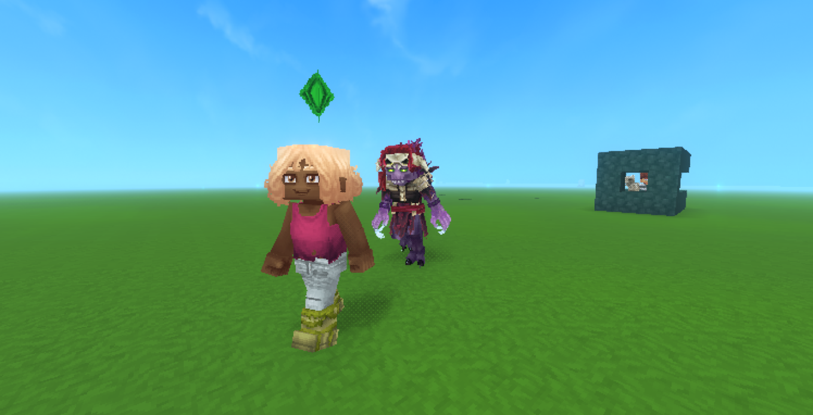

## Por onde começar

1. [Instalação](#installation)
2. [Começando](#getting-started) — chame seu primeiro NPC e dê a ele uma casa
3. [Construindo uma casa](#building-a-house)

## As outras trilhas

Esta seção é para **jogadores**. Se você gerencia um servidor ou quer trabalhar no código:

- **[Servidor](https://simtale.kukkie.org/admin/intro)** — comandos, IA gerativa, balanceamento e solução de problemas
- **[Desenvolvedor](https://simtale.kukkie.org/dev/intro)** — arquitetura, sistemas e como expandir o mod

> **Nota:** Documentação em andamento
> O mod está em fase de testes e não tem um lançamento público. O comportamento descrito aqui pode mudar entre versões, e algumas partes ainda não foram validadas no jogo — onde for o caso, a página informará.
>

---

### Instalação

### Requisitos

| Item | Versão | Obrigatório |
|---|---|---|
| Servidor Hytale | `>= 0.5.8` | sim |
| Caskara (banco de dados) | `>= 3.0.0` | sim |
| RuneCore | 1.0.12 | sim — usado para aplicar dano e cura aos NPCs |
| Java | 25 | apenas para compilar (build) |

> **Nota:** De onde vêm esses números
> `ServerVersion` e `Dependencies` no `manifest.json` do mod. A dependência do RuneCore não
> está declarada lá, mas o código chama `com.cookie.runecore.api.StatHelper` — sem esse jar, a fome
> não consegue tirar nem restaurar a vida.
> 

### Instalar

1. Solte `SimTale-1.0.0.jar`, `Caskara.jar` e `RuneCore-1.0.12.jar` na pasta `Mods/` do servidor.
2. Inicie o servidor.
3. Entre em um mundo e crafte seu primeiro Contrato de Imigração.

```
[SimTale] Scan found 2 new beds and 1 new chests. Totals: 2 beds, 1 chests
```

Essa linha é o rastreio de móveis que roda quando você entra em um mundo. Ela só aparece quando encontra
algo novo.

### Compilando a partir do código (Build)

```bash
./gradlew deploy
```

A task `deploy` compila o jar e o copia para a pasta `Mods` do Hytale.

> **Atenção:** Feche o jogo antes de compilar
> A cópia é atômica justamente para evitar problemas, mas compilar com o jogo fechado ainda é mais seguro.
> O Hytale monitora a pasta `Mods` e recarrega o mod sozinho quando o arquivo muda — com um
> jar de 11 MB, um recarregamento disparado no meio da gravação gerou um erro `ZipException: invalid LOC header` e nenhum NPC foi carregado.
> 

### Verificando se funciona

Entre no jogo, faça (craft) um **Contrato de Imigração** (Immigration Contract), e use-o.

Se um NPC aparecer com um nome próprio e um diamante flutuando sobre a cabeça (o *plumbob*,
que mostra o humor), o mod está rodando.

### Desinstalação

Remova o jar da pasta `Mods`. Os dados dos NPCs continuam no banco de dados do Caskara; reinstalar o mod trará todo mundo
de volta.

---

### Começando

O caminho mais curto entre "Instalei o mod" e "Tenho uma vila viva". 

### 1. Traga um NPC

Você precisa convidar um residente para iniciar sua vila. Faça (craft) um **Contrato de Imigração** (Immigration Contract) em uma bancada Fieldcraft usando:
- 1x Mapa/Pergaminho (`Deco_Scroll`)
- 1x Tinteiro (`Deco_Inkwell`)
- 1x Couro Leve (`Ingredient_Leather_Light`)

Use o contrato para invocar um novo residente. 

O NPC gerado recebe um dos **800 modelos visuais distintos** e é instanciado com propriedades aleatórias para nome, matriz de personalidade, traços comportamentais, ocupação, hobbies e preferências alimentares.

### 2. Construa uma casa

Um NPC sem casa vaga sem rumo e nunca dorme direito. O mínimo que conta como uma casa:

- paredes e um teto fechando o espaço
- uma **porta**
- uma **fonte de luz**
- um **assento**
- uma **mesa**
- uma **cama**

Para verificar sua construção, aponte um **Projeto de Casa** (House Blueprint) para a cama.


A ferramenta dirá se a estrutura é válida e o que está faltando. Detalhes em
[Construindo uma casa](#building-a-house).

### 3. Deixe que ela reivindique a cama

Assim que a casa estiver pronta, o NPC caminhará até a cama e registrará aquele lugar como seu. A partir de então ela mora lá: volta para dormir, come dos baús daquela casa e abre a porta ao entrar.

Use o **Livro do Estalajadeiro** (Innkeeper's Ledger) para verificar quem mora onde.


### 4. Coloque comida

Coloque um baú **dentro da casa** e deixe comida nele. NPCs vão procurar por um baú dentro de um raio de 24 blocos quando estiverem com fome.

> **Atenção:** O baú deve pertencer a uma casa
> NPCs usam apenas baús que pertencem a uma casa reconhecida. Um baú largado no meio do nada é ignorado — e é isso também que os mantém longe dos baús de tesouro espalhados pelo mundo.
> 

Veja o que eles realmente conseguem alcançar usando a **Lupa do Intendente** (Quartermaster's Glass).

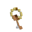

Ela lista cada baú registrado, a que casa ele pertence e quanta comida tem dentro.

### 5. Fale com ela

Aponte para o NPC e aperte **F**, ou clique com o botão direito. Isso abre o painel de interação, com fome, energia, humor, traços, gostos e as ações disponíveis.

<div style="text-align: center;">
  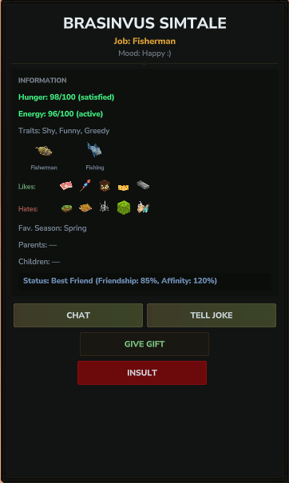
</div>

Os resultados das interações são calculados com base no status do relacionamento, humor e traços:
- **Flertar (Flirt):** Aceito por parceiros ou NPCs tímidos; rejeitado por inimigos e NPCs irritados.
- **Piada (Joke):** Falha totalmente com inimigos, melhora o humor de parceiros tristes/irritados.
- **Presente (Gift):** Comida dada quando a fome está abaixo de 70 será comida imediatamente, restaurando saúde e alterando a diversão.

Veja [Interagindo com NPCs](#interacting).

### 6. Deixe o tempo passar

O mod é deliberadamente lento. Começando de 100 de fome, um NPC leva cerca de sete horas do jogo para ficar genuinamente com fome. Aos 5 de fome, eles começam a morrer de fome, chorando e largando todas as tarefas até serem alimentados. Quinze horas do jogo sem comida não os matará, mas eles se recusarão a trabalhar.

---

### Problemas iniciais comuns

| Sintoma | Causa provável |
|---|---|
| O NPC não dorme | A cama não está registrada, ou não há uma casa válida. Verifique com o **Livro do Estalajadeiro**. |
| O NPC não come | O baú não pertence a uma casa. Verifique com a **Lupa do Intendente**. |
| Nenhum NPC aparece sozinho | NPCs não nascem mais automaticamente. Você deve craftar e usar um Contrato de Imigração. |
| A casa é rejeitada | Faltam móveis ou o espaço não está fechado. O **Projeto de Casa** diz qual o problema. |

---

### Construindo uma casa

Uma casa não é apenas qualquer construção. O mod valida a estrutura antes de aceitá-la, e um NPC só
se muda para uma construção aprovada.

### Os requisitos

#### Estrutura

O espaço deve estar **fechado**: paredes e um teto sem nenhuma abertura por onde a checagem possa vazar. Portas
contam como parede fechada.

O interior é limitado a **512 blocos**. Passando disso, a checagem desiste e rejeita a casa — esse
limite existe para que uma caverna aberta não seja confundida com uma mansão. (A menos que você esteja tentando construir as minas de Moria, 512 blocos costumam ser mais do que suficientes).

#### Mobília obrigatória

| Requisito | Qualquer bloco cujo id contenha |
|---|---|
| **Fonte de luz** | `torch` (tocha), `lantern` (lanterna), `candle` (vela), `campfire` (fogueira), `glow` (brilho), `lamp` (lâmpada), `chandelier` (lustre) |
| **Assento** | `chair` (cadeira), `stool` (banquinho), `bench` (banco), `seat` (assento), `sofa` (sofá), `couch` (sofá) |
| **Superfície** | `table` (mesa), `workbench` (bancada), `desk` (escrivaninha), `counter` (balcão) |

#### Opcional, mas você vai querer

| Item | Por quê |
|---|---|
| **Cama** | Sem uma, ninguém mora lá. A casa é identificada *pela sua cama*. |
| **Baú** | Sem um, os residentes não têm de onde tirar comida. |

### Checando

Aponte um **Projeto de Casa** (House Blueprint) para uma cama registrada.


A ferramenta dirá se a estrutura passou e, se não, **o que está faltando**. Ela também
relata quantos blocos do interior foram visitados, e quantas portas e baús foram encontrados.

> **Dica:** Chunks descarregados atrapalham
> Se parte da casa estiver em um chunk descarregado (unloaded chunk), a checagem sinaliza o resultado como incompleto em vez
> de rejeitá-lo. Fique perto da casa ao fazer a checagem.
> 

### A casa é identificada por sua cama

Este é o detalhe mais importante e o mais fácil de errar: **a identidade da casa vem
da cama**.

O que isso significa na prática:

- Duas camas no mesmo cômodo podem se tornar duas casas. (Oh my god, they were roommates...)
- Quebrar a cama do residente libera a casa.
- Mover a cama pode ser interpretado como uma casa diferente.

Essa é uma limitação conhecida, e transformá-la em um identificador próprio já está nos planos para o futuro.

### Portas

Uma porta ocupa quatro blocos, e duas portas lado a lado formam uma porta dupla. Os NPCs as abrem e as fecham
enquanto passam. (Hodor ficaria orgulhoso).

### A seguir

[Camas e moradores](#beds-and-residents) — como um NPC reivindica uma cama e o que acontece quando dois
deles querem a mesma.

---

### Camas e moradores

### Reivindicando

Um NPC sem cama procura uma cama vazia por perto. Quando encontra uma, ele vai até lá, reivindica a cama, e
a partir de então aquela casa passa a ser o seu lar.

A reivindicação é exclusiva: uma cama, um morador. Casais são a exceção — eles dividem a mesma casa.

### Camas ocupam seis blocos

Uma cama não é um único bloco. Ela ocupa **seis**, e apenas um deles é a âncora (anchor).

Isso importa por um motivo que você pode notar no jogo: a pose de dormir é calculada a partir da âncora. Quando
o mod montava um NPC em um dos outros cinco blocos, a pessoa dormia torta, flutuando ao lado da
cama, ou atravessada nela como uma cruz.

Hoje, o mod resolve qualquer um dos seis blocos de volta para a âncora antes de colocar alguém na cama.

### Quem está dormindo onde

Use o **Livro do Estalajadeiro** (Innkeeper's Ledger).

Ele abre uma tela listando cada cama registrada com suas coordenadas e seu dono.

A tela também mostra a contagem total, assim o aviso "nenhuma cama registrada" pode ser diferenciado de "a lista não carregou".

### Quebrando uma cama

Quebrar a cama de um NPC que está dormindo faz com que ele acorde perfeitamente e libere a casa. Ela passará a procurar
outra cama.

### Cronograma de sono

| Quem | Dorme |
|---|---|
| Todo o resto da vila | à noite, a noite toda |
| Guardas | durante o dia |

Um NPC com a energia no máximo ainda vai para a cama ao anoitecer — quem manda é o relógio, não o cansaço. Ela
fica dormindo até de manhã, para não pular da cama no exato momento em que a energia chegar em 100%.

A exaustão ainda é um gatilho separado: um NPC que fica sem energia durante o dia tira um cochilo
e acorda quando estiver descansado.

> **Dica:** Pular a noite os acorda
> Executar o comando `time set day` acorda NPCs adormecidos imediatamente, porque acordar segue o relógio do mundo
> em vez de um cronômetro fixo.
>

---

### Vilas

Construa casas próximas umas das outras e elas se tornarão uma vila. Você não precisa posicionar nenhum item para que isso aconteça,
e não há nenhum marcador ou item que possa ser perdido.

### Como se forma

Duas casas pertencem à mesma vila quando suas camas estão a cerca de **40 blocos** de distância uma da outra,
e isso gera uma corrente: se a casa A está perto da B, e a B está perto da C, todas as três formam uma vila, mesmo que A e C estejam
muito distantes entre si.

Portanto, uma vila cresce à medida que você constrói — expandindo-se a partir do que já existe. Uma longa rua de casas
com 30 blocos de distância entre elas formará uma única vila, por maior que a rua fique.

O centro fica no meio das camas, e a vila se estende dali até a casa mais distante
acrescida de uma pequena margem.

### Ela desaparece se você a destruir

Uma casa só existe por causa de sua cama. Quebre a cama e a casa deixará de existir, e a vila será recalculada
sem ela. Quebre todas as camas e não sobrará vila alguma.

> **Nota:** Diferente de outros jogos de propósito
> Em outros jogos de construção de blocos, o centro da vila costuma ser algo fixo. Você pode derrubar todas as construções e o jogo ainda
> tratará as ruínas como uma vila. Aqui, a vila é calculada a partir das casas que existem naquele exato
> momento, então não sobra nada para trás que possa estar errado.
> 

### O que ela muda

**NPCs sem casa param de vagar sem rumo.** Anteriormente, um NPC sem-teto ficava à deriva — cada passeio começava
onde o último terminava, então ele se afastava cada vez mais e você tinha que ir procurá-lo.
Agora ele passeia apenas ao redor da vila.

O limite é flexível de propósito: um NPC ainda sai da vila para trabalhar, pescar ou buscar comida.
Ele apenas não vai mais embora à toa.

**Guardas patrulham a borda.** Um guarda sem inimigos para lutar faz um circuito caminhando pela fronteira da
vila, que é de onde os problemas geralmente vêm. Um guarda que não pertence a uma vila fica parado onde está.

---

### Interagindo com NPCs

Aponte para um NPC e aperte **F**, ou clique com o botão direito. O painel de interação será aberto.

<div style="text-align: center;">
  
</div>

### O que o painel mostra

| Seção | Conteúdo |
|---|---|
| Cabeçalho | Nome, trabalho, humor |
| Necessidades | Fome e energia, codificadas por cor conforme a gravidade |
| Traços | Traços de personalidade |
| Identidade | Trabalho e hobby, como ícones de itens |
| Gostos | Tudo o que ela gosta e odeia, como ícones |
| Família | Pais e filhos |
| Status | Porcentagens de relacionamento, amizade e afinidade |

As cores na barra de fome seguem os limites que a rotina realmente usa: verde acima de 50, amarelo abaixo de 50, laranja abaixo de 25, vermelho abaixo de 5. No nível 5, o NPC chora e abandona todas as tarefas.

### Ações

| Botão | O que ele faz |
|---|---|
| **Conversar (Chat)** | Bate-papo. Dá um pequeno aumento na Amizade (+5) e Afinidade (+5 a +10). Se a IA Gerativa estiver ativada, o NPC escreverá ativamente uma resposta. |
| **Contar piada (Joke)** | Dá certo ou fracassa dependendo do senso de humor dela. Falha totalmente se forem inimigos. Anima parceiros tristes/irritados. NPCs com o traço `ENGRAÇADO` (`FUNNY`) dão um aumento massivo de +15 na afinidade. |
| **Flertar (Flirt)** | Exige uma boa base de relacionamento. Diferente de certo jogo simulador de vida, você não pode simplesmente floodar a interação de flerte 50 vezes seguidas até eles casarem com você. Falha garantida e queda de relacionamento se forem inimigos, estranhos ou se o NPC estiver irritado. Facilmente aceito por parceiros ou NPCs com o traço `TÍMIDO` (`SHY`). |
| **Dar presente (Gift)** | Entrega o que você estiver segurando. (Veja abaixo a lógica de presentes) |
| **Insultar (Insult)** | Custa até -30 de confiança e afinidade, e ela se lembrará disso. (Clementine vai se lembrar disso). Parceiros vão reagir muito mal. |
| **Dar bronca (Scold)** | Específico para os seus filhos. As reações variam conforme a idade: Adolescentes ficam com raiva, Adultos ficam entediados, e Bebês/Crianças pequenas ficam tristes. Dar bronca repetidamente reduz a confiança e afinidade. |
| **Atribuir trabalho (Assign job)** | Define o trabalho dela com base na ferramenta que você está segurando (ex: segurar uma enxada atribui Fazendeiro). |
| **Ver gravidez (View pregnancy)** | Abre o painel de gestação |
| **Inventário (Inventory)** | Abre o inventário dela |

### Presentes

O que ela acha de um presente depende, nesta ordem:

1. **Está na lista de favoritos?** Grande ganho (+30 afinidade).
2. **Está na lista de odiados?** Grande perda (-25 afinidade).
3. **Tem relação com o hobby?** Ganho sólido (+22 afinidade) — abaixo de um favorito explícito, acima de qualquer coisa genérica.
4. **É lixo?** (terra, areia, pedra, teia de aranha, ossos, veneno, sucata) Perda (-20 afinidade).
5. **Personalidade**: O traço `GANANCIOSO` (`GREEDY`) valoriza mais (+25 afinidade); o `PARANOICO` (`PARANOID`) reage mal (-10 afinidade).
6. **Qualquer outra coisa**: pequeno ganho por educação (+15 afinidade).

#### Comida é um caso especial

Se a fome dela estiver em 70 ou menos e o presente for comestível, ela o comerá na mesma hora em vez de guardá-lo. Isso restaura a fome e a saúde, cancela o estado de passar fome, e altera sua diversão com base no gosto pessoal dela.

Acima de 70 de fome, a comida volta a ser tratada como um presente comum.

#### O Item Bebê

<div style="text-align: center;">
  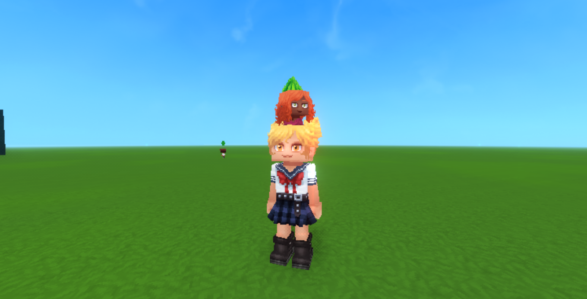
</div>

O  **Bebê** é inicialmente um item. Após algum tempo, ele se transformará e nascerá como um NPC criança. (Só não esqueça ele dentro de um baú, a menos que você queira uma criança muito confusa nascendo no seu estoque!)

### Casamento

Para pedir um NPC em casamento, você deve dar de presente uma **Aliança de Casamento** (Wedding Ring). (Um Anel para a todos governar... não, espera, franquia errada).
O pedido só será aceito se o relacionamento de vocês tiver pelo menos **80 de Romance** e **70 de Amizade**. Se aceito, o NPC se tornará seu cônjuge.


### Conversando com IA

O mod pode rotear as conversas através de uma Inteligência Artificial generativa para que as respostas sejam escritas em tempo real, em vez de serem escolhidas de uma lista. Isso deve ser ativado nas configurações do servidor — veja
[IA Gerativa](https://simtale.kukkie.org/admin/generative-ai).

> **Nota:** Apenas pelo painel
> Atualmente, as respostas por IA funcionam apenas através do painel de interação. Digitar no chat normal do jogo sempre trará as respostas baseadas em roteiros predefinidos, mesmo com a IA ativada.
>

---

### Necessidades

Todo NPC possui cinco necessidades, todas começando em 100 e caindo com o tempo.

| Necessidade | O que ela motiva a fazer |
|---|---|
| **Fome** | Procurar por comida; se chegar no fundo, ele para de fazer qualquer outra coisa. (O bolo pode ser uma mentira, mas ainda enche a barriga) |
| **Energia** | Ir para a cama |
| **Social** | Procurar outros NPCs para conversar |
| **Diversão** | Sair para praticar um hobby. (Muito trabalho e pouca diversão fazem do NPC um aldeão muito chato) |
| **Higiene** | Entrar na água para tomar banho. (Remover a escada da piscina não vai prendê-los lá dentro de verdade) |

Os traços alteram a velocidade. Um NPC `PREGUIÇOSO` (`LAZY`) gasta energia duas vezes mais rápido; um `ENGRAÇADO` (`FUNNY`) perde diversão pela metade da velocidade.

### Fome em detalhes

A fome é a necessidade com as consequências mais duras, por isso ela tem limites claros:

| Fome | O que acontece |
|---|---|
| abaixo de 50 | procura comida **quando estiver ocioso** |
| abaixo de 25 | **larga o que estiver fazendo** para comer |
| abaixo de 5 | começa a perder vida |

A interrupção aos 25 existe porque um NPC ocupado acabaria passando fome ao lado de uma despensa cheia —
antes, a fome só era checada enquanto ele estivesse ocioso.

#### Linha do tempo

Começando de barriga cheia:

| Marco | Fome | Tempo decorrido |
|---|---|---|
| Procura comida se ocioso | 70 | ~4,2 h |
| Interrompe o que está fazendo | 25 | ~10,4 h |
| Para de trabalhar e chora | 5 | ~13,2 h |

#### Fome não mata

Um NPC que fica sem comida não morre. Ele fica miserável e inútil: ele abandona seu emprego, seu
hobby e sua vida social, e fica desse jeito até que alguém o alimente. A morte é reservada ao envelhecimento
e a doenças, que ainda não foram implementados.

Ele ainda consegue pegar comida por conta própria — estar passando fome não o impede de caminhar até um baú, e
isso não interrompe o sono.

### O que a comida restaura

A comida é classificada pelos próprios dados de item do jogo em três níveis. Carne crua, ingredientes e colheitas
são de nível 1; qualquer coisa cozida ou preparada é de nível 2 ou 3.

| Nível | Fome | Saúde |
|---|---|---|
| 1 (cru) | +25 | +6 |
| 2 | +45 | +14 |
| 3 (cozido) | +65 | +24 |

Ao escolher de um baú, o nível importa mais que o gosto: uma torta odiada ainda ganha de um suculento, porém cru, pedaço de
carne que ele ama.

### Alimentando à mão

Dê comida para um NPC cuja fome está em 50 ou menos e ela a comerá na mesma hora em vez de guardar
no bolso — restaurando fome e vida, e rendendo muito mais gratidão a você do que um presente comum.

Comida odiada ainda alimenta. Ela come reclamando, ganha menos status e sofre uma queda no humor.

### Vendo os números

Fome e energia aparecem no topo do painel de interação, divididas em cores por gravidade. As cores
seguem os mesmos limites que a rotina usa, assim o painel e o comportamento nunca discordam.

---

### Personalidade e gostos

Cada NPC é gerado (rolado) no momento do spawn e nunca muda. É isso que faz com que dois moradores com o mesmo emprego
se comportem de forma diferente.

### Traços

| Traço | Efeito |
|---|---|
| `AGRESSIVO` (`AGGRESSIVE`) | Conversas podem virar discussões |
| `CARENTE` (`NEEDY`) | Leva insultos muito a sério, perdendo muita afinidade |
| `TÍMIDO` (`SHY`) | Diálogos e reações únicas a flertes românticos |
| `PREGUIÇOSO` (`LAZY`) | Perde energia duas vezes mais rápido |
| `GANANCIOSO` (`GREEDY`) | Dá mais valor a presentes |
| `PARANOICO` (`PARANOID`) | Reage mal a presentes |
| `ENGRAÇADO` (`FUNNY`) | Perde diversão pela metade da velocidade |
| `LEAL` (`LOYAL`) | Amizades não decaem com o tempo (Planejado) |

### Gostos

Cada NPC sorteia:

- 2–3 **comidas favoritas** e 2–3 **comidas odiadas**
- 2–3 **itens favoritos** e 2–3 **itens odiados**

Isso dá até seis coisas de que ele não gosta. O painel de interação mostra a **lista inteira** como ícones, não
apenas uma amostra — quando o painel mostrava apenas o primeiro item, fazia os NPCs parecerem não odiar algo que, na verdade, odiavam
muito.

Dar um favorito é sempre bom. Dar algo odiado custa afinidade e piora o humor.

> **Dica:** Gostos coincidem
> A variedade de comidas é pequena, então é comum que dois NPCs odeiem a mesma coisa. Se um presente der errado com
> alguém de quem você não esperava, abra o painel e verifique a lista real antes de achar que é um bug.
> 

### Estação e clima favoritos

Por enquanto, é apenas visual — mostrado no painel, usado para dar um tom nos diálogos.

### Humor

O humor é representado pelo cristal (plumbob) flutuando sobre a cabeça: `NEUTRO` (`NEUTRAL`), `FELIZ` (`HAPPY`), `BRAVO` (`ANGRY`), `TRISTE` (`SAD`), `ASSUSTADO` (`SCARED`), `COM SONO` (`SLEEPY`), `ANIMADO` (`EXCITED`), `ENTEDIADO` (`BORED`).

Ele reage ao que acontece: comer o prato favorito, ser insultado, uma boa conversa, praticar um
hobby. O humor é **contagioso** — um NPC feliz conversando com um triste pode animá-lo.

Qualquer necessidade caindo abaixo de 10 o deixará miserável, independentemente de qualquer outra coisa.

---

### Relacionamentos

Cada NPC mantém um relacionamento separado com cada jogador e com outros NPCs.

### Os números

| Valor | Significado |
|---|---|
| **Amizade** (Friendship) | Proximidade geral |
| **Romance** | Interesse romântico |
| **Confiança** (Trust) | Disposição para aceitar pedidos |
| **Afinidade** (Affinity) | Reação de curto prazo às suas últimas ações |

### Escada de status

`DESCONHECIDO` (`UNKNOWN`) → `ESTRANHO` (`STRANGER`) → `CONHECIDO` (`ACQUAINTANCE`) → `AMIGO` (`FRIEND`) → `BOM AMIGO` (`GOOD_FRIEND`) → `MELHOR AMIGO` (`BEST_FRIEND`)

Ramo romântico: `NAMORANDO` (`DATING`) → `NOIVOS` (`ENGAGED`) → `CASADOS` (`MARRIED`).
Ramo negativo: `RIVAL` e `INIMIGO` (`ENEMY`).

O status muda o que ela diz a você. A mesma saudação tem palavras diferentes para um estranho e para
um cônjuge.

### Como aumentar

| Ação | Efeito |
|---|---|
| Conversar | Ganho pequeno, mas confiável |
| Contar uma piada | Depende do senso de humor dela |
| Flertar | Romance, se ela for receptiva |
| Dar um presente favorito | Grande ganho |
| Alimentá-la quando estiver com fome | Grande ganho — maior que o de um presente comum |
| Insultar | Perda, e ela se lembra disso |

### Ela se lembra

Os NPCs guardam a memória dos eventos. Insultar alguém tem um efeito que dura além do momento: por um tempo
depois disso, ela te cumprimentará de forma diferente.

### NPC para NPC

Os NPCs conversam entre si por conta própria quando a necessidade social deles cai. Uma conversa aumenta a necessidade social de
ambos os lados e constrói amizade entre eles, e essa amizade sobrevive a uma reinicialização do servidor.

O humor se espalha através dessas conversas. Um NPC `AGRESSIVO` (`AGGRESSIVE`), ou dois que já são inimigos, transformam
a conversa em uma discussão: ambos saem de mau humor e gostando menos um do outro.

> **Nota:** Ninguém é arrastado para fora da cama
> Um NPC que está dormindo ou trabalhando nunca é escolhido como parceiro de conversa. E se a energia acabar no
> meio da conversa, ela abandona o bate-papo e vai para a cama — o parceiro que ficou para trás não congela.
> 

### Casamento

Dê uma aliança de casamento (`WeddingRing`) para um NPC com alto nível de romance e amizade e ela
aceitará. NPCs casados dividem a mesma casa.

Se os números não forem altos o suficiente, ela te rejeitará.

---

### Família e crescimento

### Gravidez

Um NPC casado pode engravidar. A gravidez se divide em três trimestres, e a velocidade de movimento cai
gradualmente conforme avança.

| Trimestre | Sintomas |
|---|---|
| 1º | Ligeiro aumento na perda de fome e energia |
| 2º | Aumento moderado na perda, lentidão moderada |
| 3º | Perda intensa, lentidão severa |

Abra o painel de **Ver gravidez** (View Pregnancy) na tela de interação para acompanhar o progresso: dia atual,
porcentagem, e tempo estimado restante em minutos reais.

A gravidez para o jogador também existe e segue um caminho próprio.

### Nascimento

No fim da gestação, o bebê nasce como um **item** que vai para o inventário. Você carrega o
bebê por aí, e pode entregá-lo para o outro pai/mãe.


### Fases de crescimento

| Fase | Notas |
|---|---|
| `BEBÊ` (`BABY`) | Carregado no inventário |
| `CRIANÇA PEQUENA` (`TODDLER`) | |
| `CRIANÇA` (`CHILD`) | Modelo de corpo reduzido. |
| `ADOLESCENTE` (`TEEN`) | Modelo levemente reduzido. |
| `ADULTO` (`ADULT`) | Rotina completa: trabalho, casa, relacionamentos |

As crianças crescem com o tempo por conta própria, e o tamanho do modelo aumenta a cada fase.

### Cuidados

Bebês precisam de cuidados. Passar o bebê de um pai para o outro divide o fardo, e existe uma
simulação offline para que o tempo que você passa fora do servidor ainda conte.

### Morte

Quando um NPC morre, o fluxo de morte do SimTale assume o controle: o corpo permanece no local e começa a sangrar visualmente. A Ceifadora (Grim Reaper) aparece
sozinha, caminha até o corpo, realiza o ritual de coleta de alma, deixa uma lápide e remove os registros
completamente. Interagir com a Ceifadora no meio do ritual segurando um Coração do Vazio (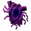 `Ingredient_Voidheart`) cancela a
coleta e revive o NPC.


> **Nota:** Nada mata um NPC ainda
> A fome, de propósito, não mata. NPCs famintos apenas choram e param de trabalhar. Envelhecimento e doenças ainda não foram implementados.
> Atualmente, o fluxo de morte só pode ser ativado por comandos administrativos de teste, que existem para que a Ceifadora possa ser testada sem precisar esperar por uma causa de morte que ainda não existe no jogo.
>

---

### Empregos e hobbies

### Empregos

| Emprego | O que faz |
|---|---|
| `DESEMPREGADO` (`UNEMPLOYED`) | Nada em especial |
| `MINERADOR` (`MINER`) | Sai em expedições de mineração e volta com minérios |
| `FAZENDEIRO` (`FARMER`) | Reivindica um Espantalho (Scarecrow), colhe e replanta plantações específicas |
| `PESCADOR` (`FISHERMAN`) | Reivindica um Posto de Pesca (Fishing Post) e coleta peixes |
| `LENHADOR` (`LUMBERJACK`) | Reivindica um Posto de Lenhador (Lumber Post) e coleta madeira. (Ele é um lenhador, mas bem calmo. Sem fúria por favor) |
| `GUARDA` (`GUARD`) | Vigia noturna — dorme de dia |
| `EXPLORADOR` (`EXPLORER`) | Explora a região |
| `CONSTRUTOR` (`BUILDER`) | Caminha até os locais de construção |
| `CAÇADOR` (`HUNTER`) | Sai em expedições de caça e volta com carne crua |

#### Atribuindo um emprego

Segure a ferramenta correspondente e use **Atribuir Trabalho** (Assign Job) no painel de interação.

| Emprego | Gatilho contém no nome da ferramenta |
|---|---|
| Minerador | `Pickaxe` (picareta) |
| Fazendeiro | `Hoe` (enxada) |
| Pescador | `Tool_Fishing_Trap` (armadilha de pesca) |
| Lenhador | `Hatchet` (machadinha) |
| Guarda | qualquer arma reconhecida — corpo-a-corpo (espada, machado, adaga, lança, maça, ...) ou à distância (arco, besta, arma de fogo, ...) |
| Explorador | `Tool_Map` (o item mapa/bússola) |
| Construtor | `Tool_Hammer` (martelo) |
| Caçador | `Shortbow` (arco curto) ou `Crossbow` (besta), especificamente |

Um NPC pode recusar: cada um deles possui uma lista aleatória de trabalhos que gosta e trabalhos que odeia.

#### Guardas e categorias de arma

O Guarda não fica mais preso à espada. Dar qualquer item que o SimTale reconheça como arma atribui
o emprego de Guarda, e o Guarda lembra se aquela arma era corpo-a-corpo ou à distância:

- **Corpo-a-corpo** (espada, machado, adaga, lança, maça, ...): o Guarda se aproxima até cerca de
  2,5 blocos antes de lutar, como sempre.
- **À distância** (arco, besta, arma de fogo, ...): o Guarda para a uma certa distância (cerca de
  7 blocos) em vez de andar até o alcance corpo-a-corpo.

Um arco ou besta continua tornando o NPC um **Caçador**, não um Guarda — essa checagem roda
primeiro, então nada mudou para o Caçador.

Como uma arma nova (de outro mod, ou de uma futura atualização do SimTale) não é algo que o
SimTale consiga prever pelo nome, existem duas formas de ensiná-lo: outro mod chamando
`WeaponCategoryRegistry.register("idDoItem", WeaponCategory.RANGED)` no próprio código dele, ou um
arquivo `simtale-weapons.json` na pasta onde o servidor roda, listando entradas
`{"idDoItem": "MELEE"}` / `{"idDoItem": "RANGED"}` manualmente. Nenhum dos dois é necessário para
as armas que já vêm no Hytale.

> **Atenção:** A correspondência é feita pelo nome do item
> A checagem procura por essas palavras dentro da ID do item, então um item de mod sem nenhuma
> dessas palavras no id ainda precisa de `WeaponCategoryRegistry.register(...)` ou
> `simtale-weapons.json` (veja acima) — ou, para os empregos que não são Guarda, simplesmente não
> será reconhecido.
> 

#### O Fazendeiro

<div style="text-align: center;">
  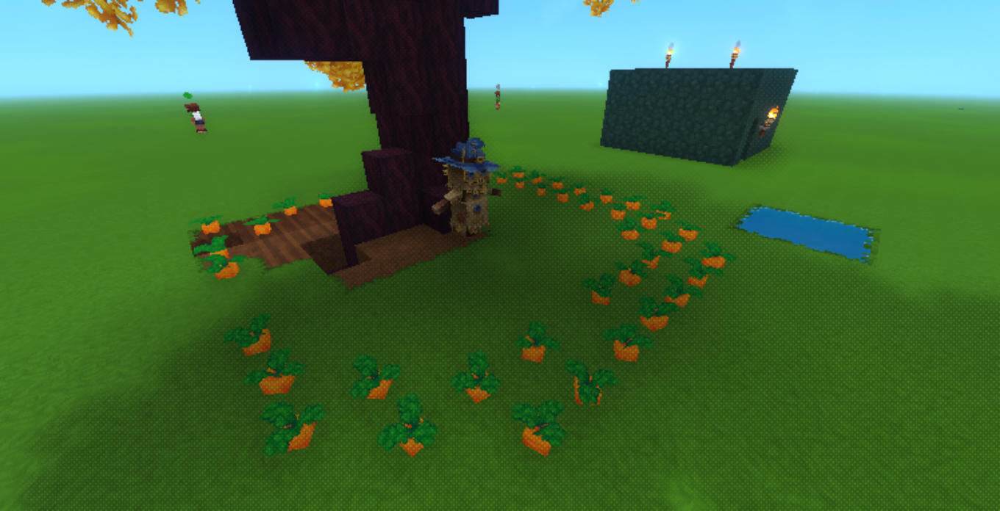
</div>

O Fazendeiro exige um **Espantalho** (Scarecrow) para atuar como sua estação de trabalho. Ele caminhará até as plantações maduras, irá colhê-las (deixando cair 1 produto e 1-2 sementes), e então levará tudo para um baú em sua própria casa. Se ele tiver sementes e houver solo arado vazio por perto, ele replantará. 
As plantações suportadas são: Cenoura, Trigo, Tomate e Milho.

#### Expedições: Mineradores e Caçadores

Mineradores e Caçadores não caminham ativamente até pedras ou animais. Em vez disso, eles saem em "Expedições".
Quando o turno de trabalho começa, o modelo deles diminui (encolhe) e eles conceitualmente desaparecem por cerca de 2 minutos reais. Quando retornam, eles surgem de volta no Centro da Vila ou em suas casas, carregando espólios baseados em uma tabela de probabilidades.
- **Mineradores** voltam com minérios (Cobre, Ferro, Prata, Ouro, Adamantium, etc.).
- **Caçadores** voltam com Carnes Cruas (Boi, Porco, Frango).
Eles caminham imediatamente até o baú de suas casas para depositar os espólios.

#### O Pescador

<div style="text-align: center;">
  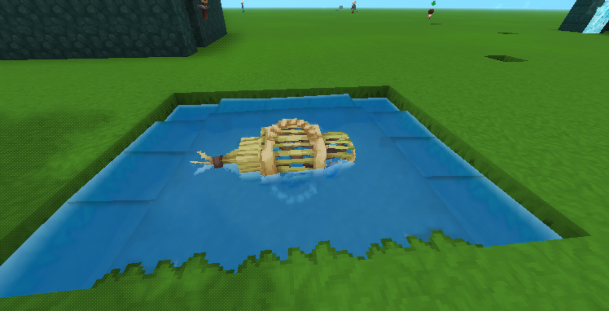
</div>

O Pescador exige um **Posto de Pesca** (Fishing Post). Para criar um, basta colocar um bloco de **Armadilha de Pesca** (Fishing Trap) perto da água (a até 8 blocos de distância).
Ele caminhará até esse posto, fará sua animação de coleta, e então depositará os peixes coletados no baú de casa.

#### O Lenhador

<div style="text-align: center;">
  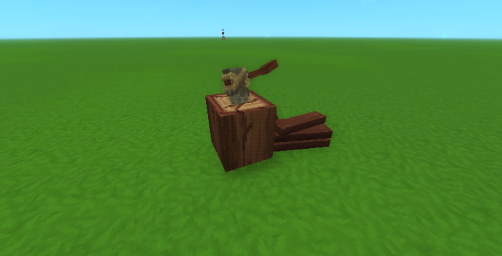
</div>

O Lenhador exige um **Posto de Lenhador** (Lumber Post). Para criar um, basta colocar um bloco de **Bancada de Serraria** (Lumbermill Bench) perto de um tronco de árvore (a até 10 blocos de distância).
Ele caminhará até esse posto, fará sua animação de coleta, e então depositará a madeira coletada no baú de casa.

### Hobbies

| Hobby | Para onde ela vai |
|---|---|
| `PESCAR` (`FISHING`) | água mais próxima |
| `MINERAR` (`MINING`) | pedra mais próxima |
| `JARDINAGEM` (`GARDENING`) | plantação mais próxima |
| `LER` (`READING`) | casa |
| `DORMIR` (`SLEEPING`) | casa |

Quando a diversão cai abaixo de 40, ela vai e pratica o seu hobby, voltando feliz.

Se o cenário não existir — um pescador no deserto, por exemplo — ela não fica presa procurando infinitamente. Ela desiste e relaxa em casa, recuperando a diversão mais lentamente.

#### Hobbies importam socialmente

- **Presentes**: dar uma vara de pescar para alguém cujo hobby é pescar vale muito mais do que um presente comum.
- **Conversa**: dois NPCs com o mesmo hobby constroem amizade mais rápido.
- **Trabalho**: um fazendeiro cujo hobby é jardinagem *ganha* diversão ao colher. Um que preferiria estar lendo perde um pouco de diversão durante o trabalho.

---

### Ferramentas e itens

SimTale adiciona um conjunto de ferramentas craftáveis. Elas existem para que a vila possa ser compreendida de dentro do jogo, sem a necessidade de digitar comandos de debug.

### O que elas fazem

| Item | Apontar para | O que acontece |
|---|---|---|
| 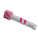 Teste de Gravidez (Pregnancy Test) | uma aldeã ou jogadora | Diz se ela está esperando um bebê e de quanto tempo |
|  Projeto de Casa (House Blueprint) | uma cama | Informa se o cômodo conta como uma casa e mostra seus contornos |
|  Livro do Estalajadeiro (Innkeeper's Ledger) | qualquer coisa | Lista todas as camas registradas e quem dorme nelas. (Os textos sagrados!) |
|  Lupa do Intendente (Quartermaster's Glass) | qualquer coisa | Lista todos os baús da vila e o que há dentro deles. (Enhance... Enhance... Enhance) |
| 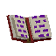 Diário do Inspetor (Inspector's Journal) | um morador | Mostra suas necessidades, humor, trabalho e o que está fazendo agora |
| 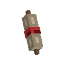 Contrato de Imigração (Immigration Contract) | qualquer coisa | Convida um novo residente para se estabelecer na vila |
| 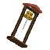 Sino da Cidade (Town Bell) | qualquer coisa | Toca o sino da cidade, alertando os moradores próximos |
|  Aliança de Casamento (Wedding Ring) | um morador | Pede em casamento (requer 80 Romance, 70 Amizade) |
|  Bebê (Baby) | nada | Um bebê carregado no inventário que eventualmente nascerá como um NPC criança |
|  Bolo de Aniversário (Birthday Cake) | qualquer coisa | Pode ser craftado, mas ainda não tem função |

### Aliança de Casamento (Wedding Ring)

<div align="center">
  
</div>

A Aliança de Casamento é usada para pedir um morador em casamento. Para que o pedido seja aceito, você precisa ter um relacionamento muito bom com o aldeão (pelo menos 80 de Romance e 70 de Amizade). Se aceitarem, vocês se casam! Caso recusem, continue melhorando a relação de vocês antes de tentar de novo.

### Bebê (Baby)

<div align="center">
  
</div>

O Bebê é um item único que representa um recém-nascido. Ele não pode ser craftado. Quando uma moradora dá à luz, um Bebê é gerado no inventário. Após algum tempo, o item do Bebê "cresce" naturalmente e se transforma em um novo NPC criança no mundo!

### Bolo de Aniversário (Birthday Cake)

<div align="center">
  
</div>

Um bolo festivo que pode ser feito na Bancada de Trabalho. Atualmente, o Bolo de Aniversário é apenas um item decorativo e ainda não possui uma função especial, mas quem sabe o que o futuro reserva para as festas da vila!

### Receitas de Criação (Crafting)

Todos os itens podem ser craftados em suas respectivas bancadas:

| Item | Bancada | Ingredientes |
|---|---|---|
| **Teste de Gravidez** |  Bancada de Alquimia (Alchemybench) | 1x  Flor Branca (White Flower), 1x 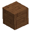 Tábuas de Madeira Macia (Softwood Planks), 1x 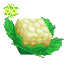 Couve-flor (Cauliflower) |
| **Projeto de Casa** | Inventário (Fieldcraft) | 1x  Mapa (Map), 1x 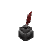 Tinteiro (Inkwell), 1x 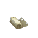 Pergaminho (Scroll) |
| **Livro do Estalajadeiro** | Inventário (Fieldcraft) | 1x  Pilha de Livros Pequena (Small Book Pile), 1x  Tábuas de Madeira Macia (Softwood Planks), 1x 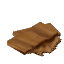 Couro Leve (Light Leather) |
| **Lupa do Intendente** | 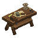 Bancada de Trabalho (Workbench) | 1x 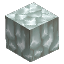 Cristal Branco (White Crystal), 1x  Barra de Cobre (Copper Bar) |
| **Diário do Inspetor** | Inventário (Fieldcraft) | 1x  Pilha de Livros Pequena (Small Book Pile), 1x  Tinteiro (Inkwell) |
| **Contrato de Imigração** | Inventário (Fieldcraft) | 1x  Pergaminho (Scroll), 1x  Tinteiro (Inkwell), 1x  Couro Leve (Light Leather) |
| **Sino da Cidade** |  Bancada de Trabalho (Workbench) | 3x Barra de Ouro (Gold Bar), 2x  Tábuas de Madeira Macia (Softwood Planks) |
| **Bolo de Aniversário** | Bancada de Trabalho (Workbench) | 1x Torta de Maçã (Apple Pie), 1x Fonte de Luz Laranja (Orange Light Source) |

#### Ícones dos Itens

         

### Projeto de Casa (House Blueprint)

<div align="center">
  
</div>

Clique com o botão direito em uma **cama registrada** — a cama é o que faz um cômodo ser uma casa, então em qualquer outro lugar a ferramenta não tem como saber de qual cômodo você está falando.

Você recebe um veredito (válida, ou a lista do que está faltando), um resumo do tamanho interior, portas e baús, e o chão do cômodo se ilumina por cerca de doze segundos: verde se a casa for válida, vermelho se não for. O contorno é apenas no chão — preencher todo o interior substituiria o cômodo por um bloco colorido gigante e esconderia o que você está tentando ver.

> **Nota:** Ele de propósito não registra nada
> Uma ferramenta de verificação não deve alterar o que ela verifica. Se o projeto registrasse a casa, você criaria residências por acidente enquanto as inspeciona. Casas continuam sendo criadas quando um NPC reivindica a cama.
> 

A única coisa que ele faz com perfeição: ele sabe exatamente a qual cama você se refere. Checar apenas por proximidade deixa de ser bom o suficiente no momento em que duas casas dividem uma parede.

### As três lentes

<div align="center">
  
  
  
</div>

O Livro (Ledger), a Lupa (Glass) e o Diário (Journal) são visões apenas de leitura dos dados que o mod já guarda. Os dois primeiros abrem as telas de visão geral de camas e baús.

> **Atenção:** Por que não há botão de Teleporte neles
> Os registros de camas e baús contêm cada entrada existente no mundo. Um item craftável com um botão de teleporte ao lado de cada entrada não seria uma ferramenta de vila, seria a viagem rápida mais quebrada do jogo. O mesmo raciocínio, embora menos dramático, vale para os botões de Desvincular e Remover: esses itens são lentes, nunca alavancas.
> 

O Diário não faz simplesmente um despejo de estado interno de debug. Um dump bruto mostraria o estado do papel (role state), slots de animação, flags de movimento e tempos de recarga de busca — o que você quer ver quando a IA está com problemas, mas que é puro ruído quando você só quer saber se alguém está com fome. O Diário relata as cinco necessidades, humor, trabalho, onde ela mora e o que está fazendo em palavras claras, em vez do nome interno da tarefa.

---

### Perguntas Frequentes (FAQ)

#### Por que meu NPC não dorme?

Provavelmente não há nenhuma cama registrada. Use o **Livro do Estalajadeiro** (Innkeeper's Ledger) — se a lista estiver vazia, a cama
nunca foi registrada. Colocar uma nova cama a registra imediatamente.

Verifique também se ela realmente reivindicou uma casa: um NPC sem casa não tem uma cama para onde voltar.

#### Por que ela não come, com um baú cheio de comida bem ali?

O baú precisa pertencer a uma **casa reconhecida**. Baús ao ar livre e baús gerados pelo
próprio mundo são ignorados de propósito.

Use a **Lupa do Intendente** (Quartermaster's Glass): se a linha disser "no house" (sem casa), esse é o problema. Transforme o espaço ao redor
em uma casa válida.

#### Ela ficou com raiva de um presente que achei que ela gostaria

Abra o painel e leia a lista de coisas **odiadas**. Cada NPC odeia até seis coisas diferentes, e a quantidade de opções de itens
é pequena o suficiente para que colisões de gosto entre NPCs sejam comuns.

#### Por que tudo é tão lento?

É proposital. Um NPC leva cerca de quatro horas no jogo para começar a procurar comida e treze para chegar
ao fundo do poço. O mod foi feito para rodar em segundo plano enquanto você joga, não para ser supervisionado a todo instante.

#### Os guardas dormem alguma vez?

Sim — durante o **dia**. Eles fazem a vigia noturna, então a rotina deles é invertida. A
energia deles cai como a de todos os outros e é recuperada na cama, apenas em um horário oposto.

#### Os NPCs conseguem abrir portas?

Sim. Eles abrem ao passar e fecham atrás deles.

#### Os NPCs sobrevivem à reinicialização do servidor?

Sim. Nomes, necessidades, relacionamentos, casas e empregos são todos mantidos salvos.

#### Posso mudar a rapidez com que ficam com fome?

Ainda não é possível fazer isso por um arquivo de configuração (config) — os valores são constantes no código. Veja
[Balanceamento](https://simtale.kukkie.org/admin/balancing).

#### Como faço para os NPCs praticarem hobbies?

Você não precisa dar ordens. Apenas coloque blocos que contenham `leisure_fishing` (pesca), `leisure_mining` (mineração) ou `leisure_gardening` (jardinagem) no mapa. Se o NPC tiver aquele hobby e sua diversão estiver baixa, ele irá interagir com o bloco sozinho.

#### Como eu crio uma vila? Preciso de um bloco central?

Não. Uma vila se forma automaticamente quando você constrói casas próximas umas das outras (cerca de 40 blocos entre as camas). A vila se expande naturalmente conforme você constrói mais casas na mesma região.

#### Como os NPCs têm filhos e como cuidar deles?

NPCs casados que moram juntos podem ter filhos. Os bebês precisam de cuidados, e você (ou os pais) podem carregá-los nos ombros ou nas costas enquanto realizam outras tarefas. Não há limite de carregar apenas uma por vez: é possível empilhar até dez crianças ao mesmo tempo, uma em cima da outra.

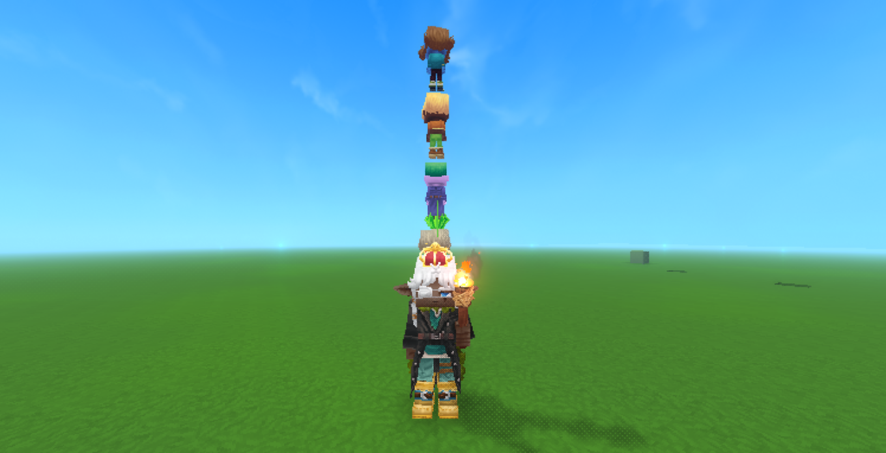

#### Como faço para colocar a criança de volta no chão?

A forma mais confiável é **agachar e pular ao mesmo tempo** — ela desce na hora, sem precisar mirar em nada. Você também pode agachar e clicar com o botão direito **em um bloco** (é obrigatório mirar em um bloco de verdade; clicar no ar não funciona), ou simplesmente digitar `/simtale putdown` no chat, que sempre funciona não importa para onde você esteja olhando.

#### Um NPC morreu. Tem como trazê-lo de volta?

Sim. Quando a Ceifadora (Grim Reaper) aparecer para coletar a alma, interaja com ela durante o ritual segurando um Coração do Vazio (`Ingredient_Voidheart`) para cancelar a coleta e reviver o NPC.