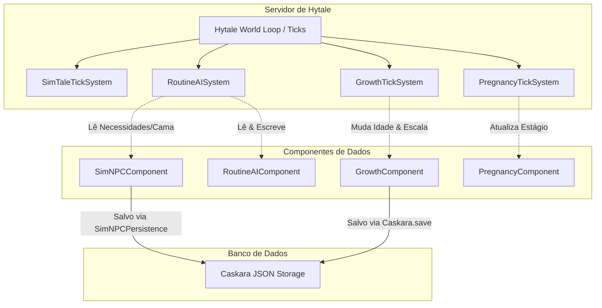

# Arquitetura Geral

> **TL;DR**: O SimTale baseia-se na arquitetura ECS de Hytale. Ele opera via sistemas de tick independentes que alteram componentes de dados anexados a entidades. A persistência é gerenciada pelo Caskara, garantindo a retenção dos estados de NPCs e jogadores em arquivos JSON estruturados.

---

## 1. O Modelo ECS (Entity Component System)
No Hytale, entidades (`EntityStore`) não possuem lógica própria. Em vez disso, elas servem apenas como recipientes (IDs únicos) contendo componentes (`Component`). Os sistemas (`TickingSystem`) varrem ciclicamente entidades que possuem componentes específicos para executar a lógica.

O SimTale registra componentes proprietários anexados a entidades existentes:
*   `SimNPCComponent`: Armazena variáveis de personalidade, humor, gostos, necessidades, família e registros de relacionamento.
*   `RoutineAIComponent`: Gerencia o estado atual da tarefa autônoma executada pelo NPC (como dormir, comer ou construir).
*   `GrowthComponent`: Anexa informações de idade, escala visual e genética para crianças.
*   `PregnancyComponent`: Controla a gestação das NPCs ou jogadoras grávidas.

### Fluxo de Dados e Conexões ECS

---

## 2. Ordem de Tick e Registro de Sistemas
A ordem com que os ticks são executados pelo servidor Hytale é crucial para evitar problemas de concorrência ou sincronização. 

1.  **`SimTaleTickSystem`**: Executa a cada tick geral do servidor, atualizando o decaimento gradual de necessidades (fome, sono, higiene, etc.) de todos os NPCs ativos.
2.  **`RoutineAISystem`**: Processa a tomada de decisão da IA autônoma baseado nas necessidades do tick anterior (Ex: se fome cair abaixo de 50, muda o estado para `FINDING_FOOD`).
3.  **`PregnancyTickSystem` / `PlayerPregnancyTickSystem`**: Atualiza o contador de gestação e aplica modificadores de status (lentidão e fadiga) baseados nos ciclos de vida.
4.  **`GrowthTickSystem`**: Processa a escala e atualizações de idade de crianças.

### Decisão de Design: Desacoplamento de Ticks
*   **Decisão**: Os sistemas de tick funcionam de forma independente ao invés de centralizados em uma única classe gigantesca.
*   **Por quê**: O desacoplamento facilita a manutenção individual de cada funcionalidade e diminui o risco de um erro na IA de rotina impedir que uma gravidez progrida ou que as necessidades de um NPC decaiam.

---

## 3. Persistência e Integração com Caskara
A persistência do SimTale é dividida em tabelas de arquivos no banco de dados local:
1.  **`SimNPCData`**: Objeto Caskara contendo o estado completo do NPC. Toda vez que um NPC é descarregado (devido à distância do jogador) ou o servidor desliga, os dados do componente `SimNPCComponent` são transferidos para `SimNPCData` e salvos. Ao carregar o chunk novamente, o componente é recriado a partir desses dados.
2.  **`GrowthComponent` / `BabyCareData`**: Salvos de forma independente com chaves prefixadas como `"child_"` e `"baby_care_"`.

---

## 4. Nível de Complexidade e Robustez
*   **Nível**: 🟡 Moderado
*   **Análise de Risco**: O sistema é robusto desde que as chaves de salvamento do Caskara permaneçam consistentes. Alterações estruturais nos campos de componentes serializáveis requerem migração ou deleção dos arquivos antigos no diretório de dados para evitar erros de desserialização (JSON parsing errors).

---

## 5. Perguntas Frequentes (FAQ)

### O que acontece se o Caskara falhar ao carregar o estado de um NPC?
O sistema possui uma lógica de recuperação: se os dados persistidos falharem ou não existirem, o `SimNPCFactory` gera novas preferências, humor e necessidades aleatórias para o NPC, evitando travamentos do jogo.

### Como as alterações nos componentes são propagadas para outros sistemas?
Hytale usa um buffer de comandos (`CommandBuffer`). Quaisquer alterações feitas por um sistema de tick (como trocar a profissão de um NPC) são adicionadas a esse buffer e aplicadas ao final do frame de tick, garantindo consistência transacional.
